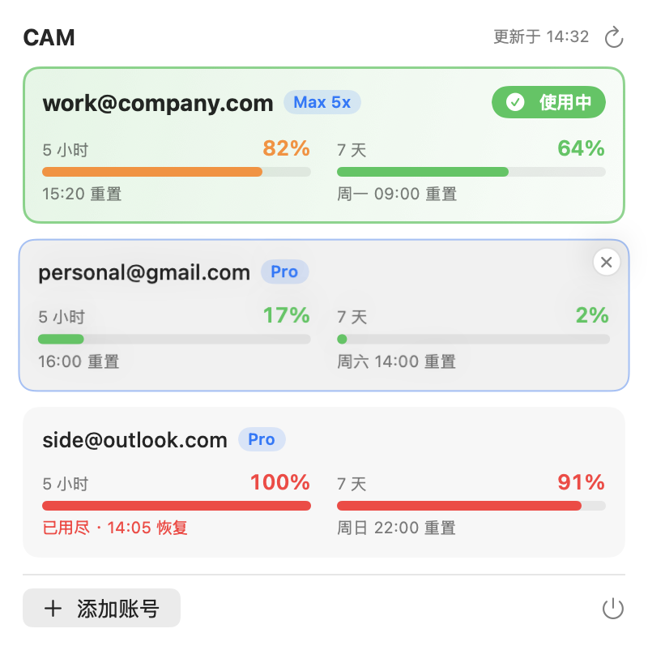
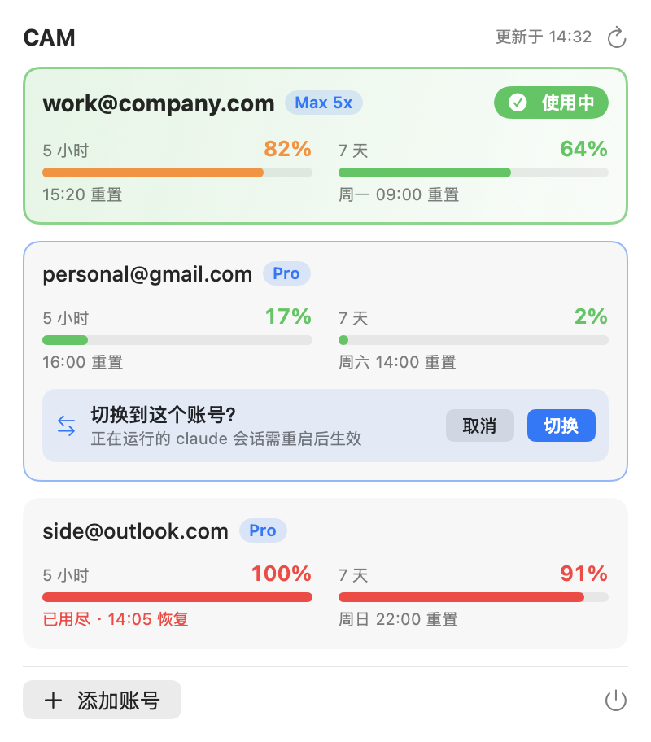
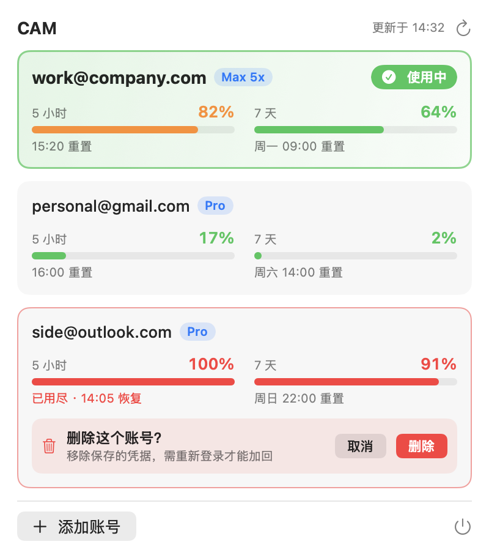

# CAM · Claude Account Manager

macOS 菜单栏小工具，用来在同一台机器上管理多个 Claude Code 登录账号：一键切换、添加/删除账号、查看每个账号的 5 小时 / 7 天用量。

<table>
  <tr>
    <td align="center"><br><sub>账号总览（hover 时出现删除角标）</sub></td>
    <td align="center"><br><sub>点击卡片 → 卡片内确认切换</sub></td>
    <td align="center"><br><sub>点击 × → 卡片内确认删除</sub></td>
  </tr>
</table>

<sub>示意图为模拟数据。</sub>

> [!WARNING]
> 本项目为非官方工具，与 Anthropic 无关，使用风险自负。作者不对账号封禁、凭据丢失等任何问题负责，详见[免责声明](#免责声明--disclaimer)。

## 功能

- **账号总览**：每个账号一张卡片，显示套餐（Pro / Max 5x …）、5 小时与 7 天用量进度条和重置时间；当前账号置顶并高亮。
- **用量配色**：< 70% 绿、70–90% 橙、≥ 90% 红；额度用尽时显示「已用尽 · 几点恢复」。
- **切换账号**：点击卡片，在卡片内确认（回车确认 / Esc 取消）。
- **添加账号**：在浏览器里走官方 OAuth 登录，**不会影响当前已登录的账号**；登录中途可随时取消。
- **删除账号**：hover 卡片右上角出现 ×，确认后从账号库移除（当前账号不可删）。
- **自动导入**：终端里用 `claude` 正常登录的账号，打开面板时会自动收进账号库。
- **终端命令**：`cam list` / `cam switch`，方便脚本化。

## 安装

要求：macOS 14+，已安装 [Claude Code](https://code.claude.com) CLI。

1. 从 [Releases](https://github.com/wiseria-ai-labs/cam/releases) 下载最新的 `CAM-x.y.z.dmg`。
2. 打开 DMG，把 `CAM.app` 拖进「应用程序」。
3. 首次打开：当前版本已用 Developer ID 签名但**尚未公证**，macOS 会提示无法验证开发者。在「应用程序」里**右键 CAM → 打开 → 打开**即可，之后正常双击。
   也可以在终端执行 `xattr -dr com.apple.quarantine /Applications/CAM.app`。

想开机自启，把 CAM 加到「系统设置 → 通用 → 登录项」。

### 从源码构建

需要 Xcode 15.3+（Swift 5.10+）。

```bash
git clone https://github.com/wiseria-ai-labs/cam.git && cd cam
swift run cam                  # 直接运行
scripts/release.sh 0.1.0       # 打包签名后的 dist/CAM-0.1.0.dmg（IDENTITY 可指定签名证书）
```

## 用法

### 菜单栏

点击菜单栏的双人头像图标打开面板。每次打开都会刷新用量，右上角 ↻ 可手动刷新。

| 操作 | 方式 |
|---|---|
| 切换账号 | 点击卡片 → 「切换」 |
| 添加账号 | 底部「添加账号」→ 浏览器登录；可点「取消登录」中断 |
| 删除账号 | hover 卡片 → 右上角 × → 「删除」 |
| 取消确认 | 「取消」/ Esc / 点击面板空白处 |

### 终端

```bash
# 装了 app 的话，命令行就是 /Applications/CAM.app/Contents/MacOS/cam
cam list                     # 列出账号与用量，* 为当前账号
cam switch work@company.com  # 按邮箱切换
cam switch 1a2b3c4d          # 或按 uuid 前缀切换
```

## 工作原理

Claude Code 的登录态由两部分组成，CAM 就是在管理这两处：

| 内容 | 位置 |
|---|---|
| OAuth 凭据（`claudeAiOauth`，同一条目里还有各 MCP server 的 `mcpOAuth`） | 登录钥匙串，条目 `Claude Code-credentials` |
| 账号资料（邮箱、组织等） | `~/.claude.json` 的 `oauthAccount` 字段 |

- **账号库**：所有账号的凭据和资料存在登录钥匙串的一个条目里（`ClaudeAccountManager`），不落盘成明文文件。
- **切换**：先把当前账号最新的凭据存回账号库（CLI 会轮换 refresh token，不存回的话旧存档会失效），再把目标账号写入 `claudeAiOauth` 和 `oauthAccount`。`mcpOAuth` 及 `.claude.json` 的其它字段原样保留。
- **添加**：在临时 `CLAUDE_CONFIG_DIR` 里运行 `claude auth login`，登录完成后把凭据导入账号库，再清理临时目录和钥匙串条目。
- **用量**：调用 `api.anthropic.com/api/oauth/usage`。非当前账号的 access token 过期时由 CAM 刷新；当前账号的 token 只读不刷新（交给 CLI，否则会让 CLI 手里的 refresh token 失效）。
- **防串号**：存回凭据前会用 token 查询它实际属于哪个账号，避免运行中的会话把旧账号 token 写回后被错存到新账号名下。

## 注意事项

- **切换后要重启正在运行的 `claude` 会话。** 已启动的会话会缓存旧凭据，混用可能导致状态错乱。新开的会话直接使用新账号。
- **依赖 Claude Code 的内部实现。** 钥匙串条目命名、凭据结构、用量接口都不是公开 API，是对照 Claude Code 2.1.287 实现的。CLI 升级后可能失效，届时需要按新版本重新核对。
- **长期不用的账号需要偶尔打开一下面板。** refresh token 有效期约 4 周，CAM 只在查询用量时顺带续期；太久没打开，该账号就得重新登录。
- **仅支持 macOS。** Linux / Windows 上 Claude Code 把凭据存成明文文件，CAM 目前没有适配。
- **钥匙串读写走 `/usr/bin/security`**，与 Claude Code 自身做法一致，因此不会弹授权框。凭据较长时会短暂出现在 `security` 进程的参数里（hex 编码），CLI 本身也是这样处理的。
- **账号库条目名为 `ClaudeAccountManager`** 是项目更名前的历史名字，为了保留已存账号没有改。
- 多账号轮换使用前，请自行确认符合 Anthropic 的使用条款，见下方免责声明。

## 开发

```bash
swift build
swift test   # 使用真实钥匙串里的临时条目，结束后自动清理；登录取消测试需要本机装有 claude
```

发版：`scripts/release.sh <版本号>` 生成 universal 的 `CAM.app` 并打成 DMG；设置 `NOTARY_PROFILE`（`xcrun notarytool store-credentials` 保存的配置名）时会自动公证并装订票据。

代码只有两个文件：`Sources/cam/Store.swift`（登录态读写、账号库、用量）和 `Sources/cam/App.swift`（菜单栏界面与终端命令）。

已知限制：面板没有滚动（账号很多时会过长）；app 在登录过程中崩溃会留下 `claude auth login` 进程。

## 免责声明 / Disclaimer

- 本项目是个人开发的非官方工具，**与 Anthropic 没有任何隶属、合作或背书关系**。「Claude」「Claude Code」是 Anthropic 的商标。
- CAM 依赖 Claude Code 未公开的内部实现（钥匙串条目、配置文件结构、用量接口），这些随时可能变化，导致功能失效或行为异常。
- 使用多个账号、频繁切换账号，或以其它方式使用本工具，**是否符合 [Anthropic 的使用条款](https://www.anthropic.com/legal/consumer-terms)由使用者自行判断并承担责任**。
- **作者及贡献者不对使用本工具造成的任何后果负责**，包括但不限于：账号被限制或封禁、登录凭据丢失或失效、用量或费用异常、数据丢失。
- 本软件按「原样」提供，不附带任何形式的担保，详见 [MIT 许可证](LICENSE)。

*English:* This is an unofficial, community-built tool. It is **not affiliated with, endorsed by, or sponsored by Anthropic**; "Claude" and "Claude Code" are trademarks of Anthropic. CAM relies on undocumented internals of Claude Code that may change at any time. **You are solely responsible for ensuring your use complies with Anthropic's terms.** The authors and contributors accept **no liability** for any consequences of using this software, including but not limited to account restrictions or suspension, lost or invalidated credentials, unexpected usage or charges, or data loss. The software is provided "as is", without warranty of any kind (see [LICENSE](LICENSE)).

## License

[MIT](LICENSE)
